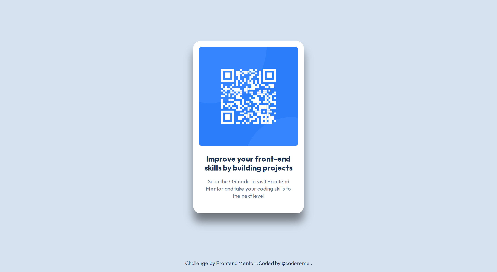

# QR Code Component

This is a solution to the [QR code component challenge on Frontend Mentor](https://www.frontendmentor.io/challenges/qr-code-component-iux_sIO_H). Frontend Mentor challenges help you improve your coding skills by building realistic projects.

## Table of contents

- [Overview](#overview)
  - [Screenshot](#screenshot)
  - [Links](#links)
- [My process](#my-process)
  - [Built with](#built-with)
  - [What I learned](#what-i-learned)
- [Author](#author)

## Overview

The challenge was to build out this QR code component and get it as close as possible to the original design.

## Screenshot

## Links

- Solution URL:[https://www.frontendmentor.io/solutions/qr-code-component-built-with-css-MNDzfeabD9](https://www.frontendmentor.io/solutions/qr-code-component-built-with-css-MNDzfeabD9)

- Live Site URL: [https://codereme.github.io/frontend-mentor-solutions/qr-code-component/index.html](https://codereme.github.io/frontend-mentor-solutions/qr-code-component/index.html)

## My process

### Built with

- Semantic HTML5 markup
- BEM Methodology
- CSS custom properties
- Flexbox
- Mobile-first workflow

### What I learned

**Semantic HTML**

- Used an `<article>` as our main card component

**Styling and Layout Approach**

- Implemented a design system based on the `Figma design` and style guide, using `CSS custom properties` for colors, font styles and elements spacing
- Wrapped everything in a `.container` div to center the component with `Flexbox`
- `Mobile-first` workflow

**Accessibility and SEO fundamentals**

- ARIA label for enhanced context
- Seo-friendly meta tags and descriptions

## Author

- Frontend Mentor - [@codereme](https://www.frontendmentor.io/profile/codereme)
- Github - [@codereme](https://github.com/codereme)
