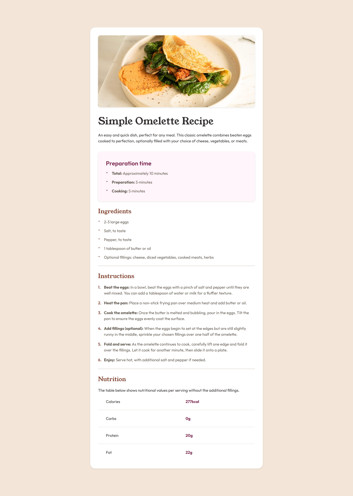

# Recipe page

This is a solution to the [Recipe page challenge on Frontend Mentor](https://www.frontendmentor.io/challenges/recipe-page-KiTsR8QQKm). Frontend Mentor challenges help you improve your coding skills by building realistic projects.

## The challenge

The goal was to build the optimal layout for the site depending on their device's screen size that closely matches the provided design.

## Screenshot



## Links

- Solution URL: [https://www.frontendmentor.io/solutions/responsive-recipe-page-with-custom-bullet-lists-and-table-styling-DYUxsKS2yK](https://www.frontendmentor.io/solutions/responsive-recipe-page-with-custom-bullet-lists-and-table-styling-DYUxsKS2yK)

- Live Site URL: [https://codereme.github.io/frontend-mentor-solutions/recipe=page/index.html](https://codereme.github.io/frontend-mentor-solutions/recipe-page/index.html)

## Built with

- Semantic HTML5 markup
- CSS custom properties
- Flexbox
- Mobile-first workflow

## What I learned

- Created custom bullets and counter list using pseudo-elements(`::before`)

```css
.list li::before {
  content: ".";
  position: absolute;
  inset-inline-start: 0;
  inset-block-start: -20px;
  font-size: 1.8rem;
}

.list--preparation li::before {
  color: var(--rose-800);
}

.list--ingredients li::before {
  color: var(--brown-800);
}
```

```css
.list--instructions li::before {
  content: counter(orderedList) ".";
  position: absolute;
  inset-inline-start: 0;
  inset-block-start: 0;
  font-size: 1rem;
  font-weight: var(--fw-semibold);
  color: var(--brown-800);
}
```

## Author

- Frontend Mentor - [@codereme](https://www.frontendmentor.io/profile/codereme)
- Github - [@codereme](https://github.com/codereme)
